# Module 1 Output Gallery

These results were collected from the completed Module 1 laboratory document and its matching recordings. Q15-Q19 are provided as MP4 demonstrations because they use animation or keyboard interaction.

| Exercise | Captured output |
| --- | --- |
| Q01 Red Center Point | 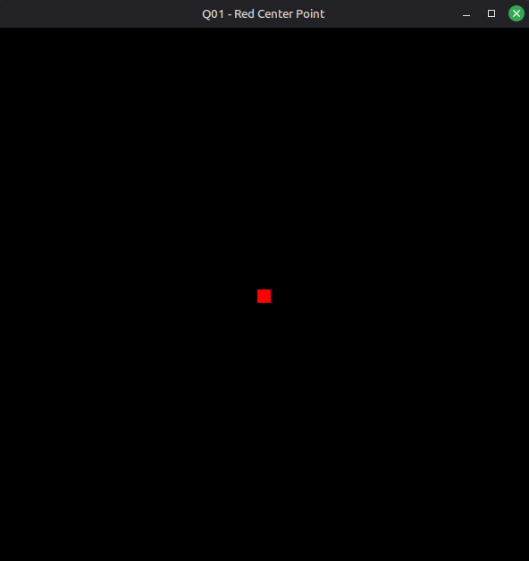 |
| Q02 Horizontal Green Line | 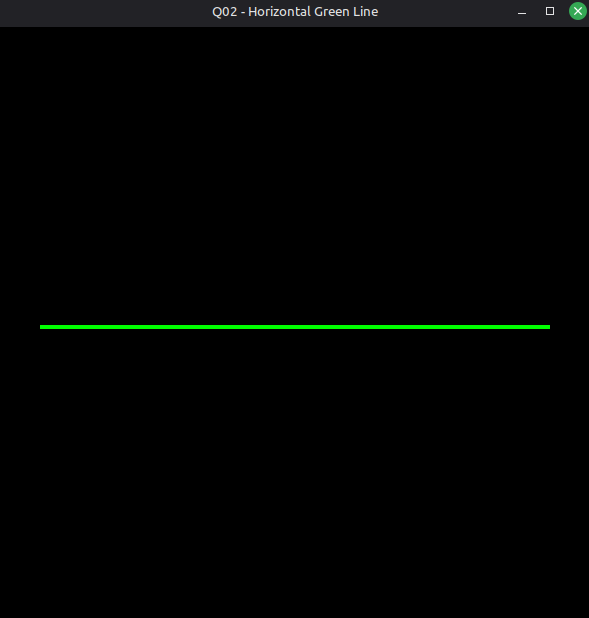 |
| Q03 Triangle Outline | 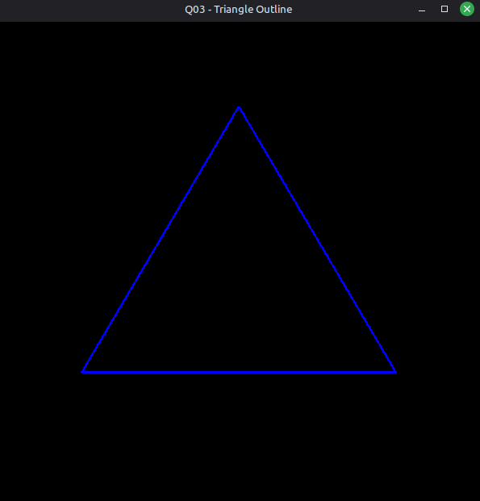 |
| Q04 Orange Rectangle | 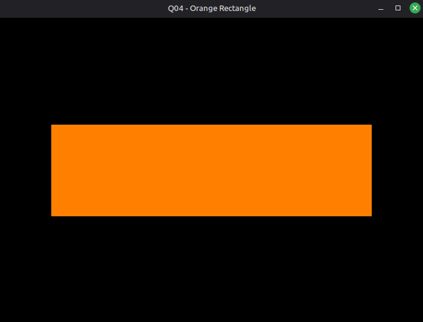 |
| Q05 Square Outline on Gray Background | 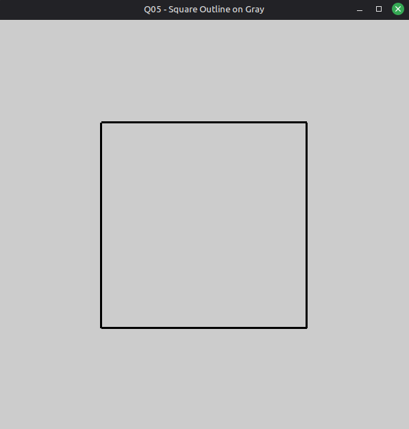 |
| Q06 Hexagon Outline | 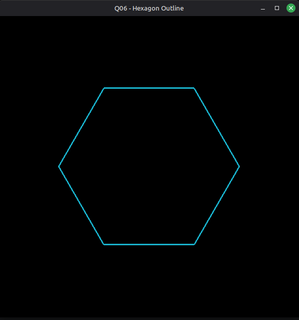 |
| Q07 Two Triangles | 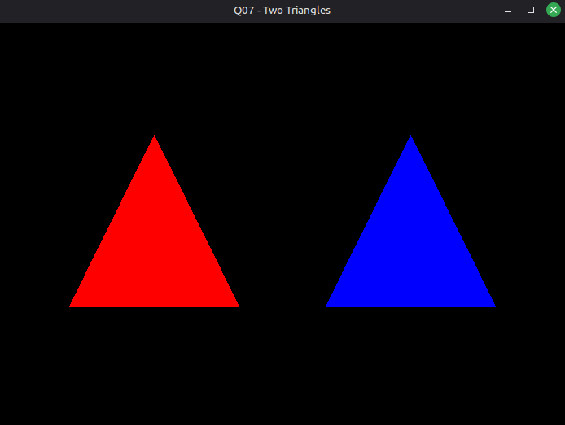 |
| Q08 Smooth Shaded Diamond | 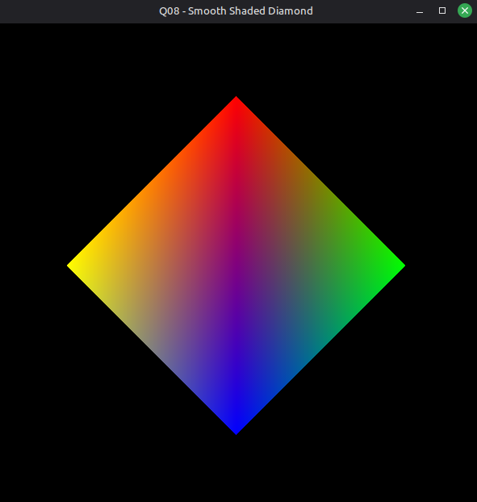 |
| Q09 4x4 Checkerboard | 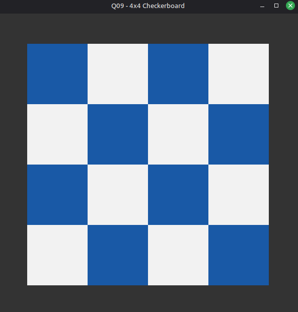 |
| Q10 Five-Pointed Star Outline | 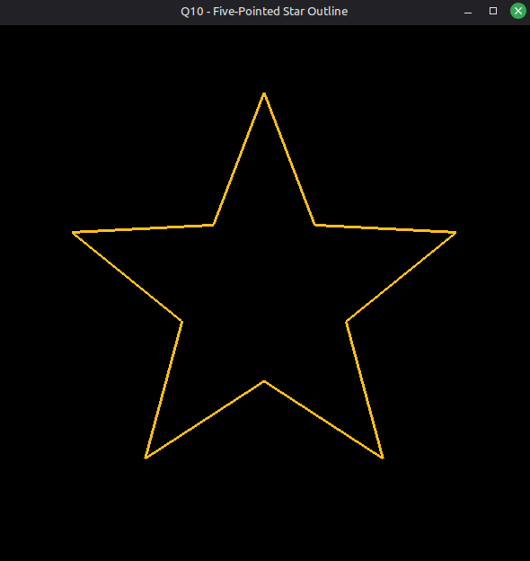 |
| Q11 Concentric Circles | 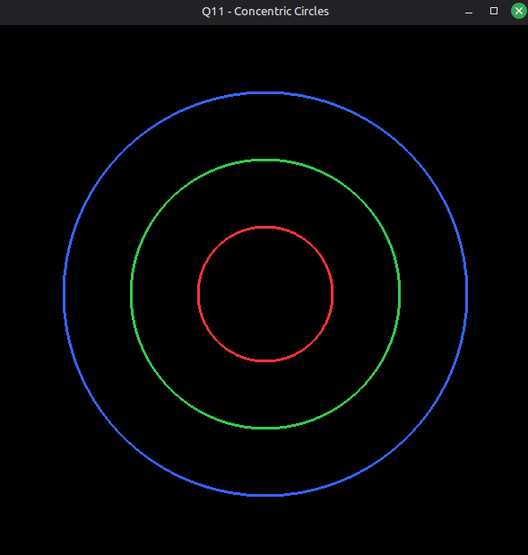 |
| Q12 Arrow | 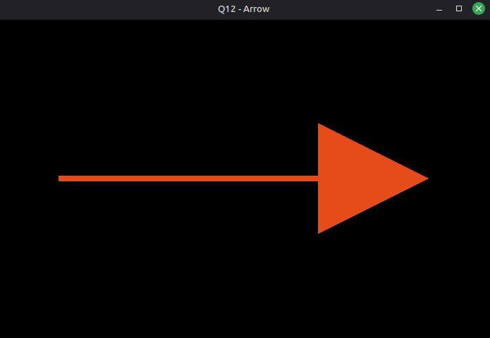 |
| Q13 Letter F From Rectangles | 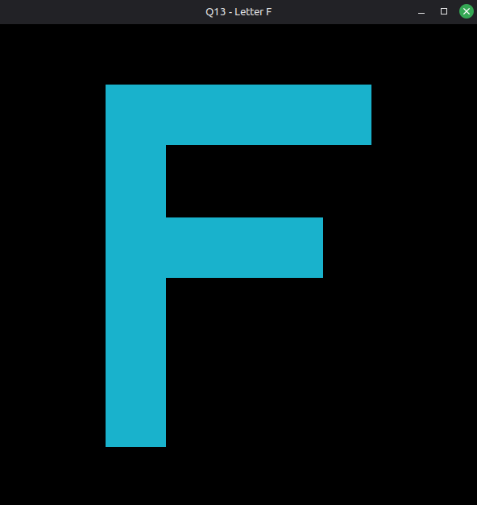 |
| Q14 Simple Landscape | 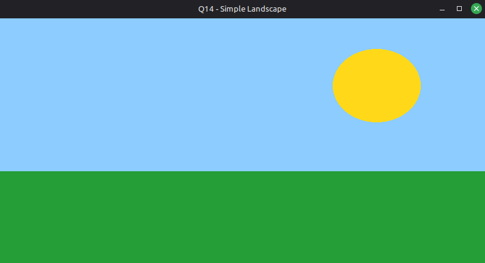 |
| Q15 Move Square With Arrow Keys | [Watch the MP4 demonstration](outputs/Q15_Move_Square_With_Arrow_Keys.mp4) |
| Q16 Bouncing Ball | [Watch the MP4 demonstration](outputs/Q16_Bouncing_Ball.mp4) |
| Q17 Traffic Light Simulator | [Watch the MP4 demonstration](outputs/Q17_Traffic_Light_Simulator.mp4) |
| Q18 Rotating Clock Hand | [Watch the MP4 demonstration](outputs/Q18_Rotating_Clock_Hand.mp4) |
| Q19 Keyboard Color Picker | [Watch the MP4 demonstration](outputs/Q19_Keyboard_Color_Picker.mp4) |
| Q20 Procedural Striped Flag With Star | 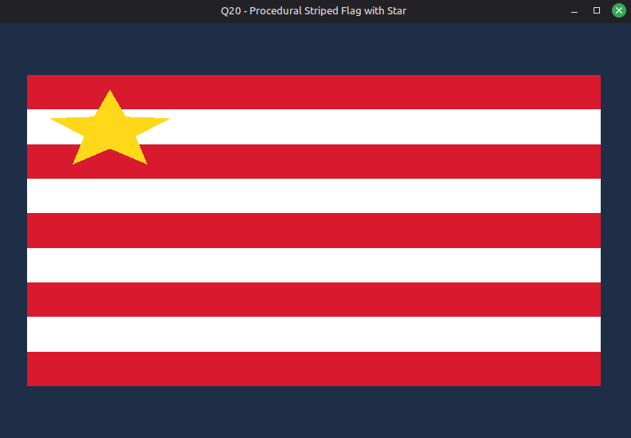 |
