# Module 2 Output Gallery

These results were extracted from the completed Module 2 laboratory document. Q15 did not have an embedded output in that document. Q17 is provided as an MP4 because it demonstrates keyboard interaction.

| Exercise | Captured output |
| --- | --- |
| Q01 Plus-Shaped Colored Points | 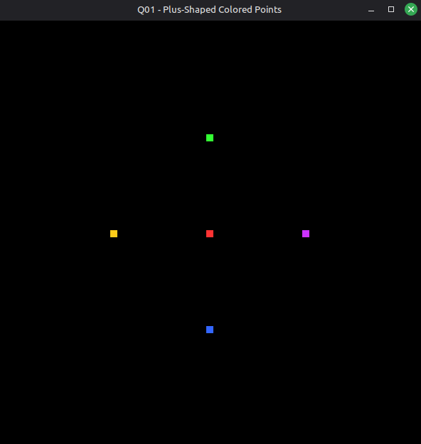 |
| Q02 Two Unconnected Lines | 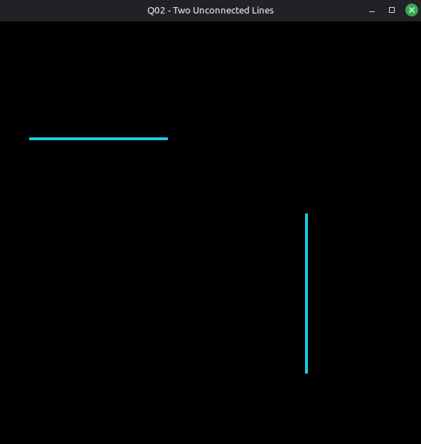 |
| Q03 Zig-Zag Line Strip | 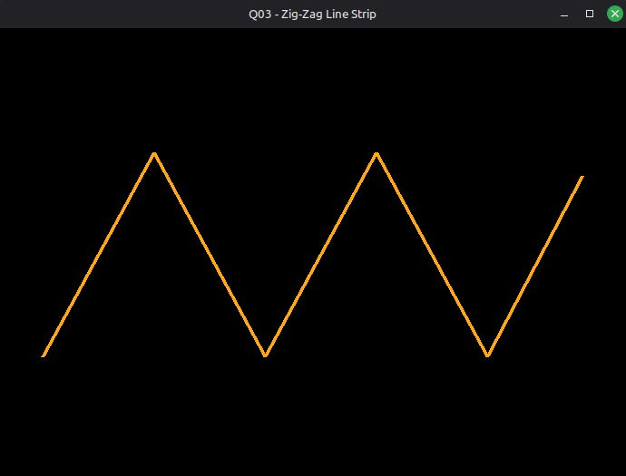 |
| Q04 Square Outline | 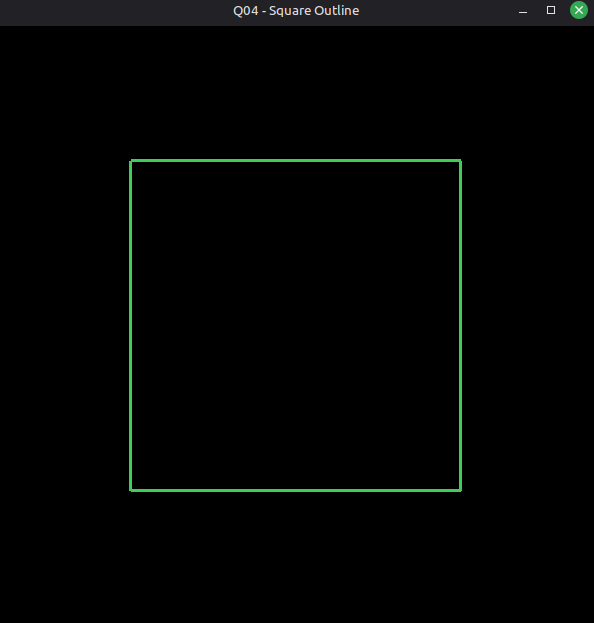 |
| Q05 Dashed Line | 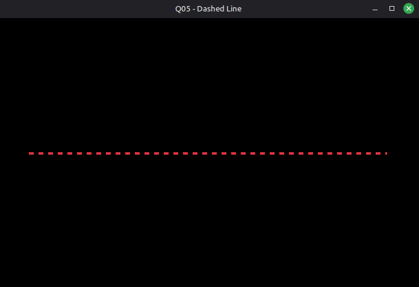 |
| Q06 Triangle With glColor3ub | 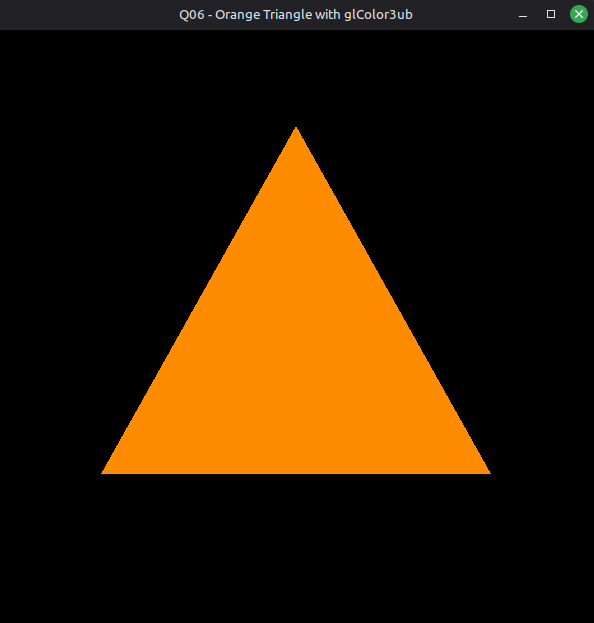 |
| Q07 One Quadrilateral | 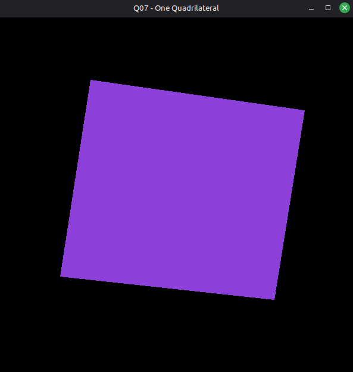 |
| Q08 Filled Hexagon | 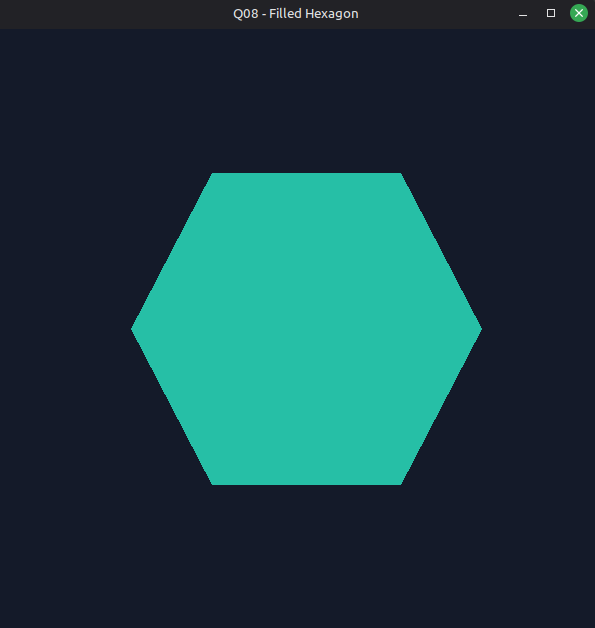 |
| Q09 Rectangle From Triangle Strip | 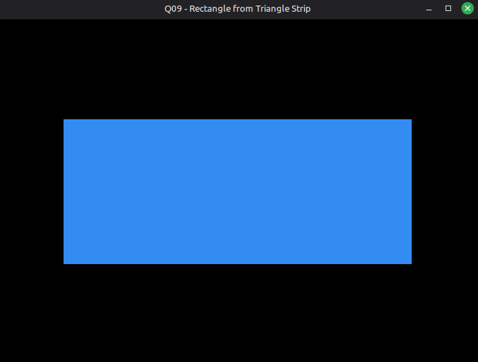 |
| Q10 Half-Circle Fan | 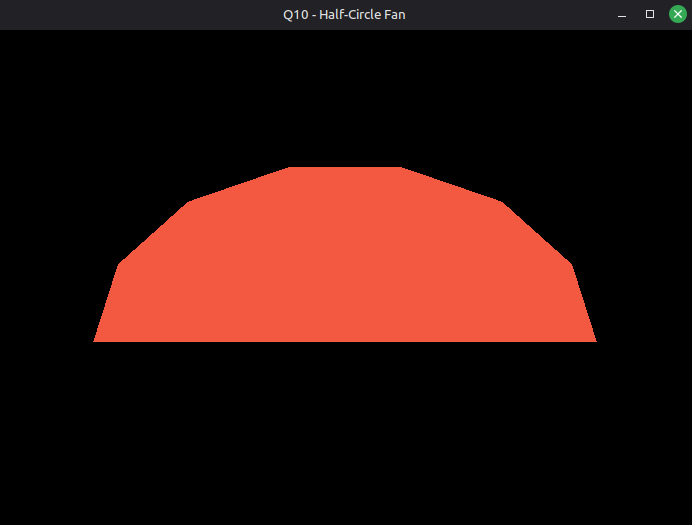 |
| Q11 Two Quads One Block | 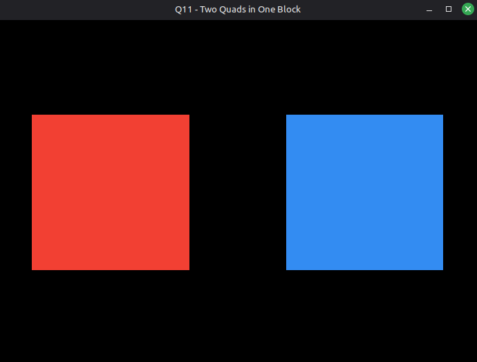 |
| Q12 Staircase Ribbon | 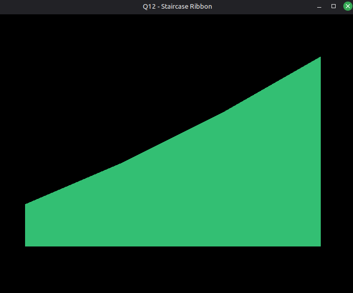 |
| Q13 Yellow-to-Purple Gradient Line | 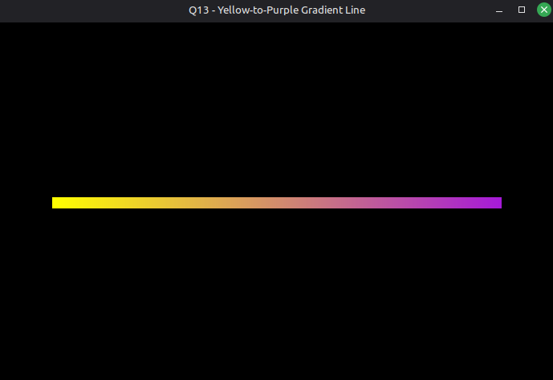 |
| Q14 Two Stipple Patterns | 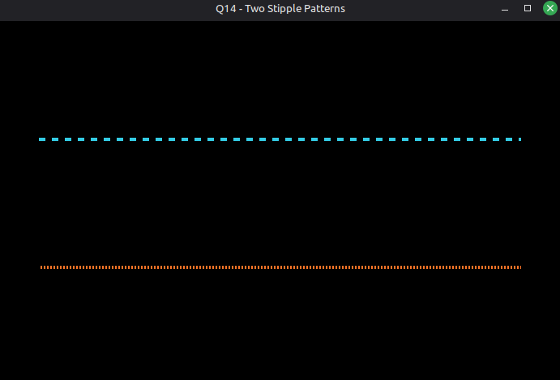 |
| Q15 Smoothly Shaded Square | Output not embedded in the laboratory document. |
| Q16 Fan and Quad Composition | 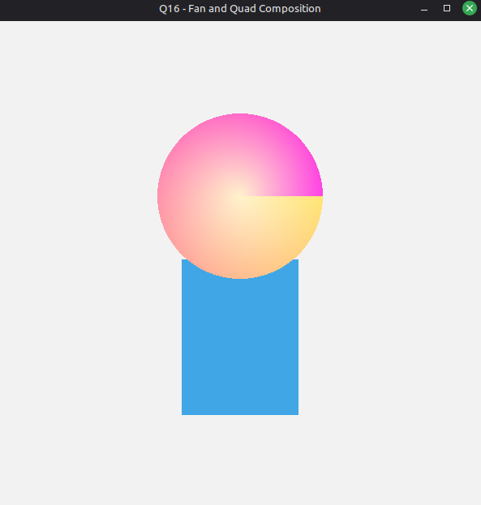 |
| Q17 Toggle Stipple With Keyboard | [Watch the MP4 demonstration](outputs/Q17_Toggle_Stipple.mp4) |
| Q18 Alternating-Color Ribbon | 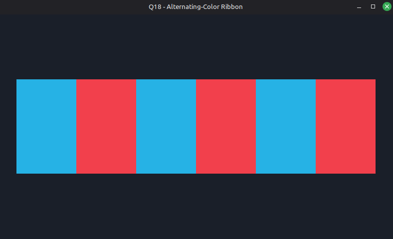 |
| Q19 Overlapping Alpha-Blended Quads | 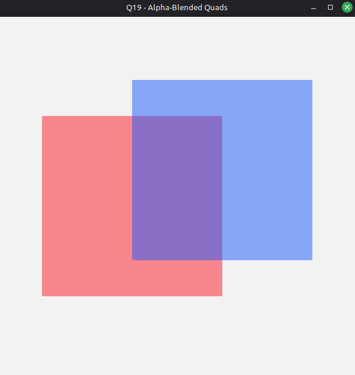 |
| Q20 Procedural Rainbow Fan | 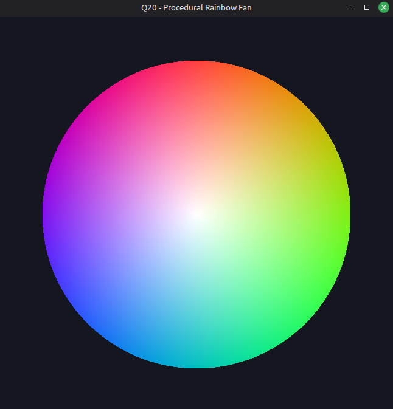 |
